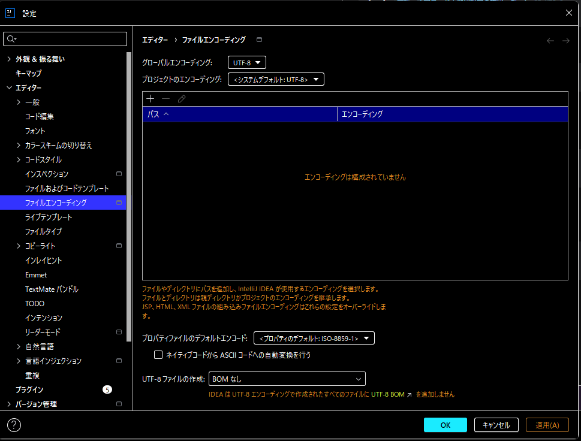

# 文字コードについて調べてみた

## 【問題】gitbashからcommitしてコメント入れると文字化けする！！！

---

## とりあえずdigった
- 保存されたファイルにも文字コードがあるし通信にも文字コードがある
- IntelliJの設定の中の話
  - グローバル、プロジェクト、デフォルト
- UnicodeとUTF-8の違い
- `git clone`の時はバイナリで持ってくるから文字コードは関係ない
- これは毎回環境が変わる度に文字コード周りの設定をしなければならない？
- chcpってなに？
- localeってなに？
- BOMについて

## 今回の事象の背景

大昔のコンピュータが半角英数にのみ対応しているASCIIコードを使用していて、

漢字やカタカナなどに対応するためにShift_JISが誕生した。

Windowsが長年Shift_JISを使用し、

世の中の標準がUTF-8に置き換わっているにも関わらず、いまだにShit_JISを固持したため今回の事象が発生したｗ

## 符号化文字集合と文字符号化方式

一言で文字コードと言っても、

- **符号化文字集合**
  
    『文字』と『文字に割り当てられた番号』を対応させる表のようなもの
    >例：ASCII,JIS,Unicode

- **文字符号化方式**
    『文字に割り当てられた番号』をエンコードする決まり
    >例：UTF-8,UTF-16,UTF-32

という２つの役割がある

問題のShift_JISは文字集合とエンコードが一体となっている規格なので

『UnicodeをShift_JISでエンコードする』という文章は間違っているし、

そもそもの元凶であります。

## 設定について

### 設定にはいくつかの階層がある

1. OS（Windows）
2. ターミナル（cmd / PowerShell / Git Bash）
3. シェル（bash / pwsh）
4. アプリ（git / IDE / editor）

### GitBashの設定の確認

```bash
locale #言語＋文字コード＋地域設定の確認　例：ja_JP.UTF-8
echo $LANG 
```
### Gitの設定の確認
```bash
git config --global --list
```

### GitBashの設定変更

一時的の場合
```bash
export LANG=ja_JP.UTF-8
export LC_ALL=ja_JP.UTF-8
```
永続的の場合

`~/.bashrc`を作って中に
```bash
export LANG=ja_JP.UTF-8
export LC_ALL=ja_JP.UTF-8
```
と書いてシェルを再起動or`source ~/.bashrc`

`.bashrc`は毎回起動時に読み込む設定ファイル

### Windowsの場合

```terminaloutput
chcp #これが確認　sjisなら932
chcp 65001　#これで一時的にUTF-8
```
もし永続的にやりたかったらGUIで環境変数で変えれば？ｗ

### IntelliJの設定



>補足：BOMについて
> 
> BOMとはByte Order Markのことで、文字コードを宣言するために先頭に入る特殊なバイト列をさす。
> 
> Windowsがメモ帳、ExcelのCSV読み込みで文字化けしないように作った。
> 
> Linuxと相性が悪くシェルスクリプトでエラーになる。

## 解決
gitbashの設定を変更しことなきを得る


## 参考
>文字コード・文字セット・文字符号化方式とは？
> 
>[https://www.yamanjo.net/knowledge/others/others_08.html](https://www.yamanjo.net/knowledge/others/others_08.html)

>「Unicode」と「UTF-8」の違い
> 
> [https://wa3.i-3-i.info/diff746moji.html](https://wa3.i-3-i.info/diff746moji.html)

## 更新履歴
- 2026-2-19 初回作成