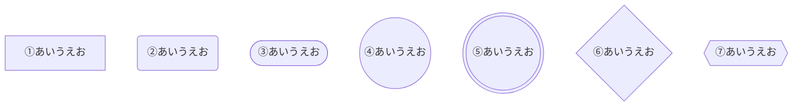
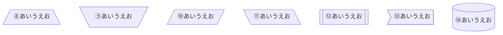
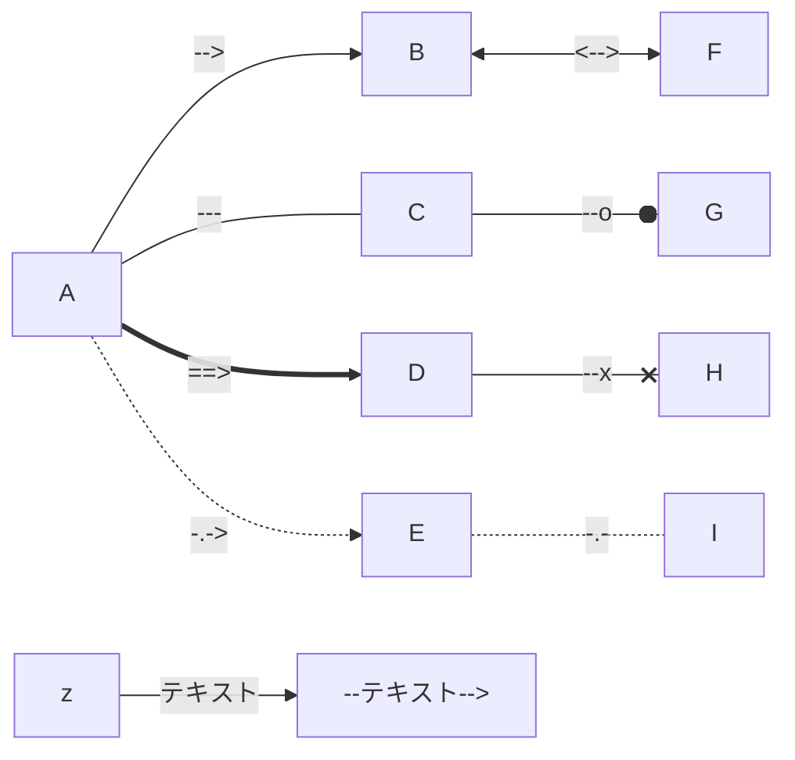
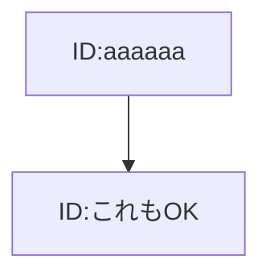
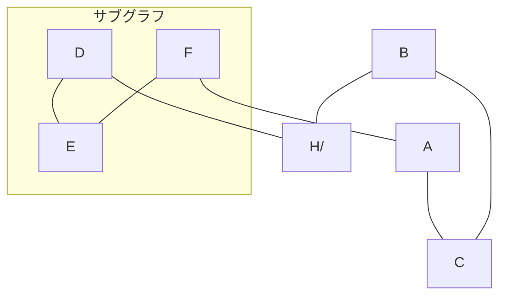
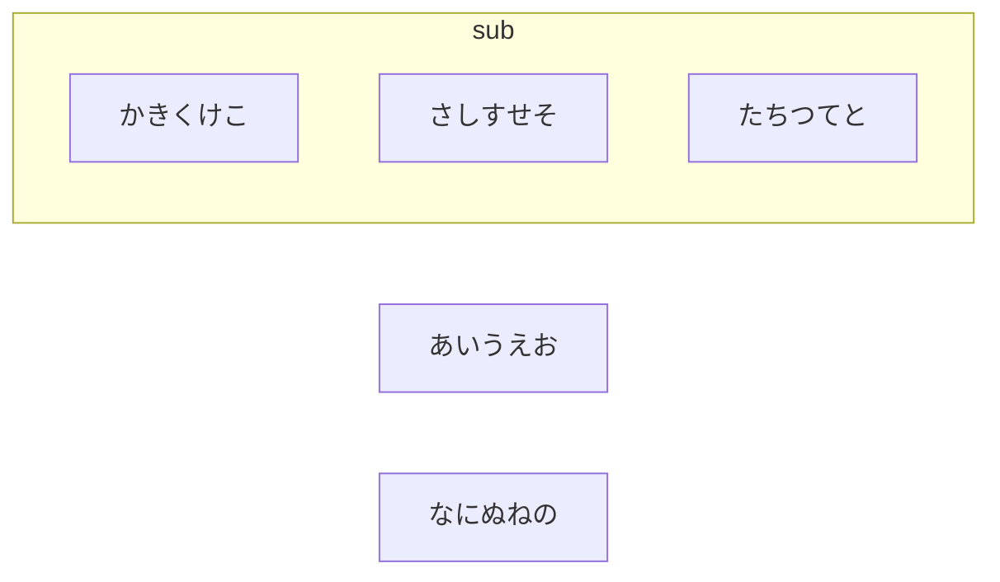
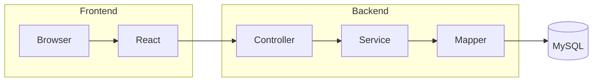
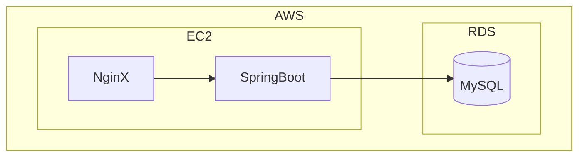
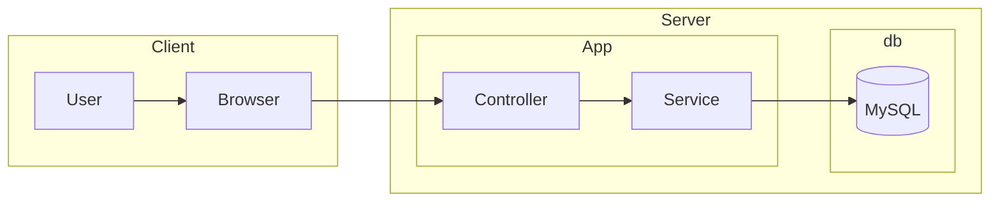

# Flowchart
Frowchartでの図式表現についてまとめる

## ノード(node)

| 番号 | 記法 | 形 | 用途 | 備考 |
|----|--------|--------|--------|-----------|
| 1  | [] | 四角 | 処理 | |
| 2  | () | 丸 | 開始/終了 | これ全然丸じゃないよねｗ |
| 3  | ([]) | 角丸 | | スタジアムノードっていうらしい |
| 4  | (()) | 二重〇 | 強調 ||
| 5  | {} | ひし形 | 条件 | |
| 6  | [//] | 平行四辺形 | 入出力 | |
| 7  | [\　\\] | | | |
| ８  | [[]] | サブルーチン | サブルーチン | |
| ９  | f>] | 非対称型 | | 左側や両方はできない | |
| 10 | d[()] | DB | DB |

## リンク

## 向き

> TD　上→下
> 
> BT　下→上
> 
> LR　左→右
> 
> RL　右→左

## ノードにIDをつける

>**以下のように好きなIDを振ることができる**
>>
>>aaaaaa[ID:aaaaaa]
>>
>>これもOK[ID:これもOK]
>>
>>aaaaaa-->これもOK

## サブグラフ

## ディレクション

## チャッピーに問題を出してもらった

## 参考
>[【まとめ】mermaid図式表現 ＞フローチャート編｜ふじけん先生｜note](https://note.com/rapid_phlox5979/m/m732d1880da7b)

## 更新履歴
2026-2-20　新規作成