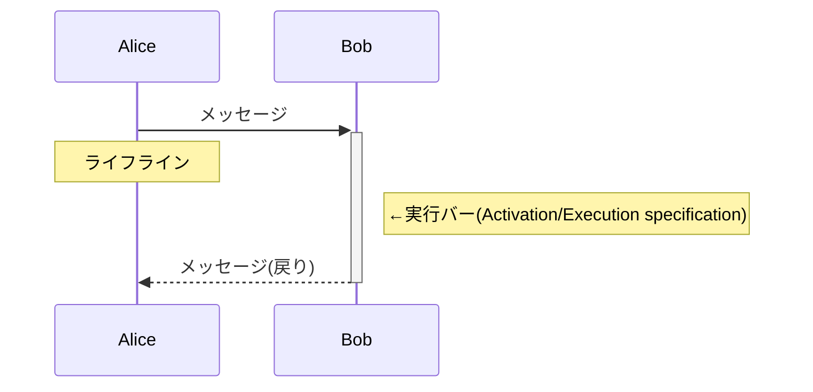
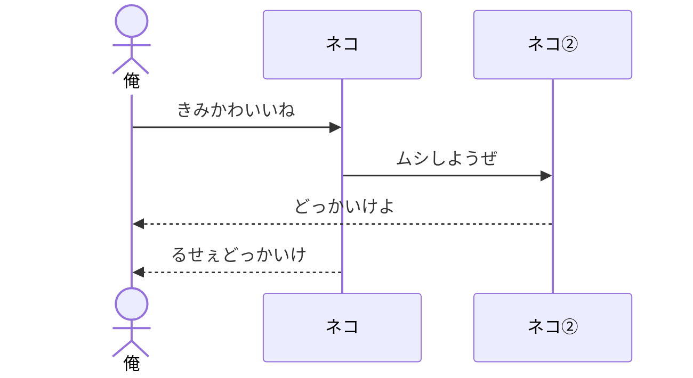
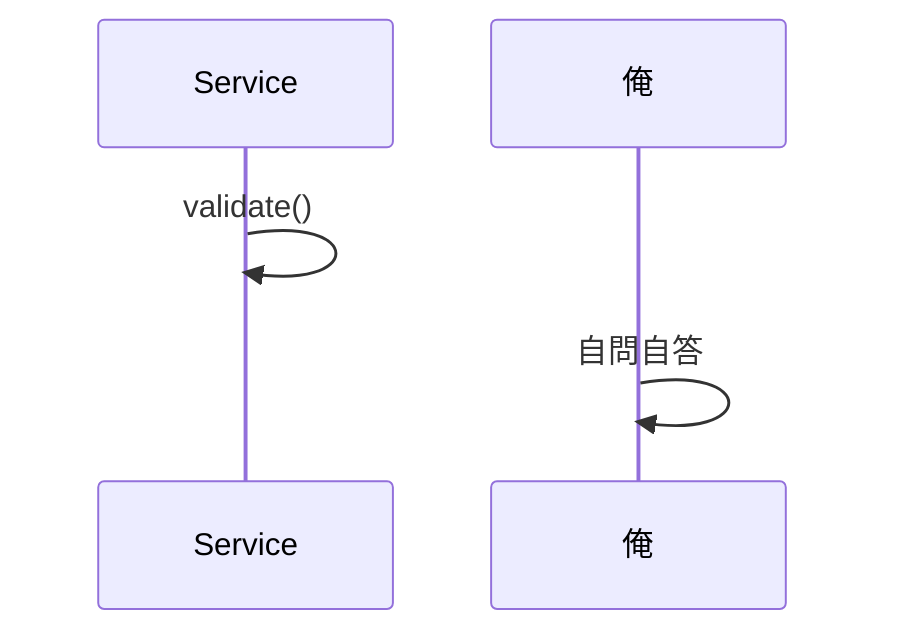
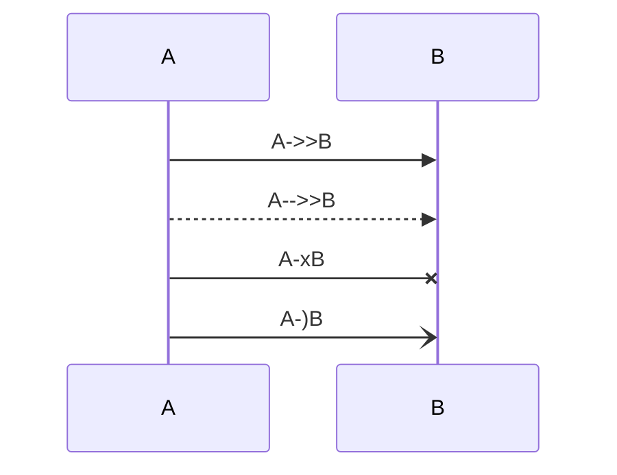
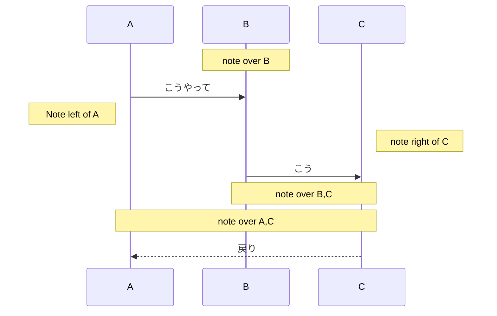
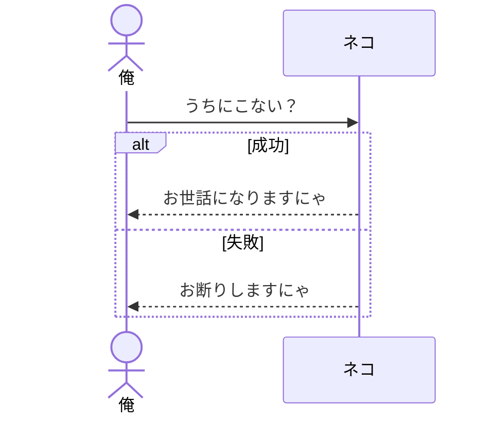
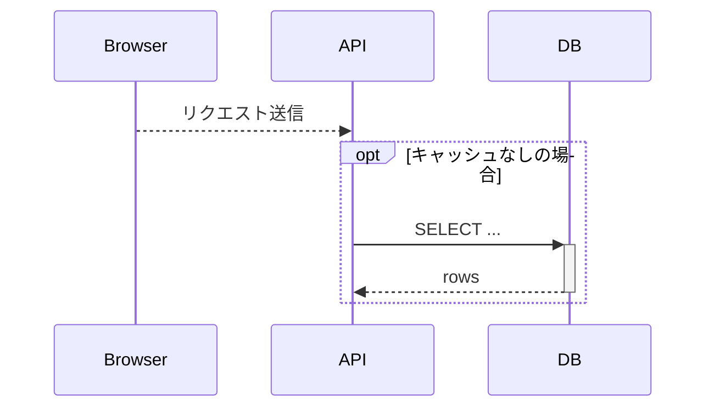
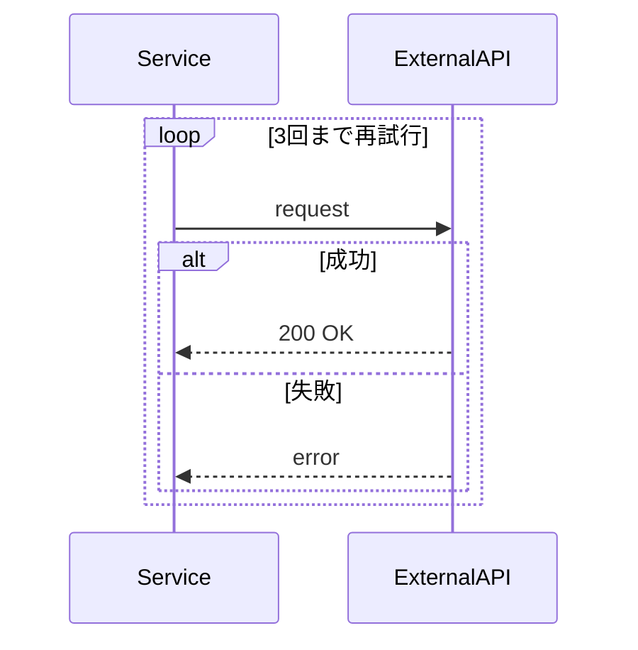
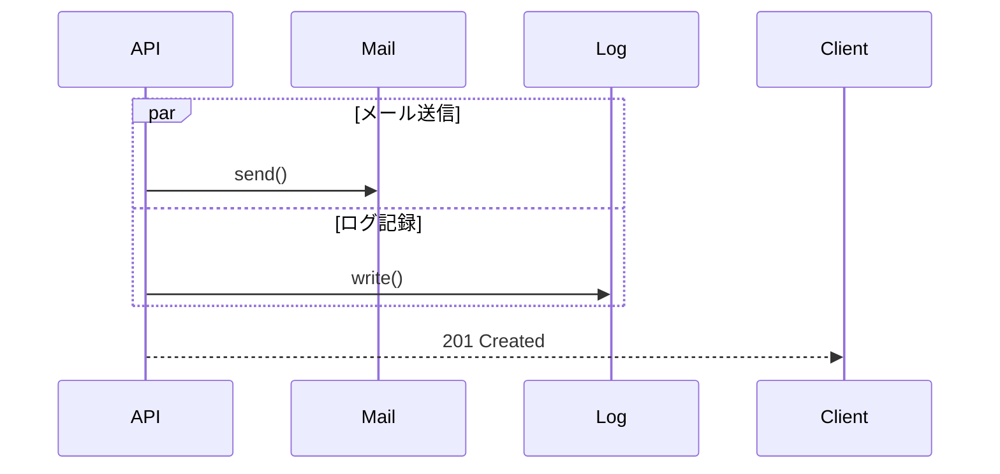
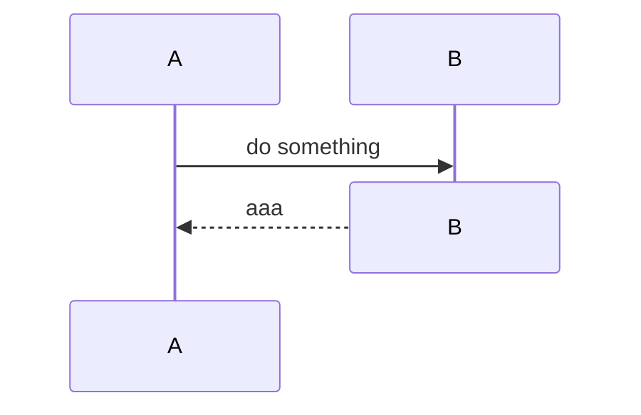

# Sequence
SequenceDiagramでの図式表現についてまとめる

複合フラグメントはＵＭＬに準拠した様々な記法があるが、ここではＵＭＬの学習よりもMermaidの学習にウェイトがあるため主要なものだけにする。
機会があればＵＭＬについて学習したいので別issueとする

## 基本

## participant / actor

>sequenceDiagram
> 
>actor 俺
> 
>participant  ネコ
> 
>participant ネコ② 
>
>俺->>ネコ:きみかわいいね
> 
>ネコ->>ネコ②:ムシしようぜ
> 
>ネコ②-->>俺:どっかいけよ
> 
>ネコ-->>俺:るせぇどっかいけ

## self call

>sequenceDiagram 
> 
>participant Service
> 
>Service->>Service: validate()
> 
>俺->>俺:自問自答

## メッセージの種類

## 注釈

## 複合フラグメント(Combined Fragment)

| 記法   | 意味          | 用途              |
|------|-------------|-----------------|
| alt  | Alternative | 分岐　認証・バリデーションなど |
| opt  | Optional    | 任意処理　キャッシュなど    |
| loop | Loop        | リトライ・ページング      |
| par  |Parallel| 並列処理　通知・ログなど    |

### alt / else

### opt

### loop    

### par

## destroy

## 参考
>[【SequenceDiagrams】シーケンス図の書き方 #uml - Qiita](https://qiita.com/dodomasaki/items/31e2210c07cb58471ac4)